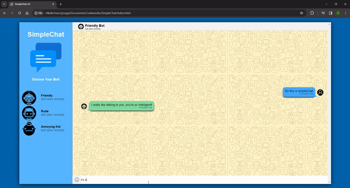

# SimpleChat
A simple one page chat app, for practicing, at first to practice my css and DOM manipulation skills. Now I've begun to refactor to have a Node js backend using PostgreSQL and sequelize, to practice working with those backend technologies.

# Features

* A layout and design based on whatsapp / telegram
* Three different chat bots with randomized replies
* Chat history for each bot as if it's real chat
* Saves chat history using postgreSQL with two models and a one to many relationship

# Video demo

link to youtube video demo : https://www.youtube.com/watch?v=g91wZ5EnTdM
